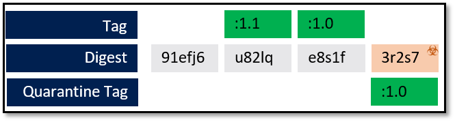

# Quarantine Pattern V1
A pattern for securing Docker Registries, restricting access to newly pushed images until verified by an external system-such as a vulnerability scanning solution.

## Introduction
One of the many advantages containers provide is the speed by which a change can be built, tested and deployed. Effort is moved up front, to assure as much as possible is done before an image is saved to a registry. Building optimized images, minimizes the steps required to run each image instance. The current registry push/pull design doesn't have implicity secure by default primitives.


While container vulnerability scanning products actively scan registries (1), protecting container hosts (4), the workflows are disconnected. As a policy, a team may require images to be scanned before being pushed to a registry, however the registry spec has no enforcement of this policy. 

Some common challenges that occur:

* An image is built, pushed, tested and deployed as 10 instances. 
* As each node instances the image, a race condition occurs, where each nodes vulnerability protection attempts to scan and verify the image. 
* Multiple nodes are now waiting for a scan to complete, slowing down, or possibly failing deployment. 

## Current State of Art
Container Vulnerability Scanning solutions scan the registry (5), out of band from a push pull. Vulnerability vendors offer configurable options for how they protect the container hosts (4).

When a host pulls an image, the computed digest of the image is compared to previously scanned images. If the image has been approved, it’s allowed to run. If it has known issues, and has been blocked,  `docker run` is blocked. However, there are various options for what to do when the host pulls an image that has not yet been scanned:

### Optimistic Scanning
If the image has not yet been scanned, it’s optimistically allowed to run while a scan begins asynchronously. If the scan finds a vulnerability, an alert is raised. However, the image has a window by which it can do damage. The image isn’t necessarily immediately stopped, leaving the opportunity for a trojan horse type attack.

### Block the Unknown
If the image has not yet been scanned, the `docker run` is blocked as the scan executes, causing a preventable failed deployment.

### Synchronous Scan
If the image has not yet been scanned, the scan begins. When the scan completes, the host is allowed to run the image if the scan succeeds. Depending on the content of the image, the scan can take enough time the deployment may timeout and fail. At best, the deployment is delayed and may fail.

## Gaps with the Current State of Art
One of the many value props for containers are their ability to quickly start. Another is their immutability. When an image is scanned, uniquely identified by its digest, it has a known state. Until new information is available, (such as new known vulnerabilities) a scanned image can be run multiple times without having to be rescanned.

The current state has the current limitations:
1. Protected nodes must either wait, (with posible race conditions), fail or be put at risk when un-scanned images are deployed.
1. Unprotected nodes, such as developer laptops, may pull from registries, with no scanning in place.
1. While a company can issue a policy requiring all images must be scanned, there’s no enforcement from a registry service.
1. Customers are starting to limit nodes to specific registry endpoints, but there’s no current model to limit a registry to secured images.
1. The workflow for push/pull has no inherent step to account for scanning.
1. While registries may implemens webhook notifications, vulnerability vendors provide webhook notifications as an option, not the default experience. Scheduled based scans lengthen the gap by which an image may be pre-scanned and increases the likelihood an image pull will be delayed, deployed or put at risk.

## The Quarantine Pattern
The Quarantine pattern enforces a gate on the registry, putting newly pushed images into quarantine, limiting the ability to pull images until they’ve been deemed safe. Asynchronous events are used to alert subsystems as to the status of a given image, enabling secure workflows.


1. A docker push is made to the registry
1. A webhook notification is sent
    * The action of the payload is `quarantine`
    * While the proposed `image:tag` is sent, the `image:tag` is not yet enabled for pull. The image is put into quarantine.
1. A vulnerability scanning solution listens to events on the registry, and pulls the image, based on the digest.
1. Once the scan is complete and verified as safe enough, the quarantine is removed. As most images have some level of vulnerabilities, the image isn’t set to quarantine pass, rather the quarantine is removed.
    * If an image has critical and blocked vulnerabilities, which have been determined by the vulnerability solution, a quarantine-block policy can be set. 
    * Setting this policy continues blocking image and digest pulls, with information indicating it has been scanned and has been deemed to be unsafe for consumption.
1. Once the quarantine has been removed, a webhook with the action of “push” is raised.
1. The release management system can listen to these events, proceeding with a deployment.

## Enabling the Quarantine Pattern
The quarantine pattern is a capability of a registry. While all registries should support event based scan notifications, the quarantine pattern is enabled at a registry level, creating a secure by default registry. Once enabled, all images are blocked, pending quarantine scanning.
To avoid blocking existing images in a registry, the scanner shall be configured to scan all existing images, and continue scanning existing images. Once the sanner has completed scans of all existing images, the user can enable the quarantine pattern.

**TBD: REST spec for enabling quarantine pattern**

## Access Roles
Registries currently support two basic roles

| Role | Capability |
| ------ | ----- |
| Reader | Members can pull images |
| Writer | Members can push images |


| Role | Capability |
| ------ | ----- |
| Reader | Members can pull images, which are NOT set to `quarantine` |
| Contributor | Members can push and pull images. Members will NOT be able to pull quarantined images |
| QuarantineReader | Inherited from Reader, with the ability to pull images that are set to quarantine. However, images will only be capable of being pulled by their digest eg: `docker pull acrdemos.azurecr.io/th@sha256:913f6` |
| QuarantineWriter | Members will be able to set policies related to quarantine, including setting and removing quarantine policies on a given image/digest | 

### Image Access
When images are placed in quarantine, they will not be accessible based on their image:tag reference. Image:tags are only accessible once taken out of quarantine.
## Registry Internal Tagging State Machine

### Happy Path
1. `docker push registry.io/trojanhorse:1.0`
    > Push returns success, as per normal registry push semantics
1. Webhook raised
    
    The digest is available within the registry, with a policy of quarantined. The tag is under quarantine, and not accessible.
1. `docker pull registry.io/trojanhorse@sha256:91ef6`
    > Vulnerability Scanning pulls the image using the digest, with a **quarantine-reader** or **quarantine-writer** role
1. Using the **quarantine-writer** role, the vulnerability scanning solution removes the quarantine state.
    ```json
    REST https://*
    ```
    
    The tag is promoted, and quarantine removed. Any reader role may pull the image by its image:tag or digest

### Secondary Tag
1. `docker push registry.io/trojanhorse:1.1`
1. Webhook raised
    
    > The digest is available within the registry, with a policy of quarantined. The tag is under quarantine, and not accessible through `docker pull registry.io/trojanhorse:1.1`.
1. `docker pull registry.io/trojanhorse@sha256:u82lq`

    > Vulnerability Scanning pulls the image using the digest, with a **quarantine-reader** or **quarantine-writer** role
1. Using the **quarantine-writer** role, the vulnerability scanning solution removes the quarantine state.
    ```json
    REST https://*
    ```
    
    The tag is promoted, and quarantine removed. Any reader role may pull the image by its image:tag or digest

## Pushing New Images With Existing Tags
While not a best practice for deployed images, customers that manage corporate registries may use stable tags for base images.

  > For info on stable and unique tagging, see: Docker Tagging: [Best practices for tagging and versioning docker images](https://blogs.msdn.microsoft.com/stevelasker/2018/03/01/docker-tagging-best-practices-for-tagging-and-versioning-docker-images/)
1. `docker push registry.io/trojanhorse:1.0`
1. Webhook raised
    
    The digest is available within the registry, with a policy of quarantined. The tag is under quarantine, and not accessible. In this case, the 1.0 tag is still available within the registry under the previous digest.
    
    This may be confusing for customers, as they pushed a new version of the tag, yet immediate pulls will still point to the previous digest. However, tag reuse should be reserved for base images, that aren't directly deployed. Deployed images should follow a best practice for uniquely tagging each image. 
1. `docker pull registry.io/trojanhorse@sha256:e8s1f`

    > Vulnerability Scanning pulls the image using the digest, with a quarantine-writer role
1. As the image is approved, the proposed :1.0 tag is known to apply to a previous digest. The :1.0 tag is moved to the newly approved digest.
    ```json
    REST https://*
    ```
    
    Any reader role may pull the image by its image:tag or digest
## Quarantine -Scan Failed
In this case, a stable tag is pushed, however the scan has determined the digest shall be blocked as the scanner has determined the image has critical, blocking vulnerabilities.
1. `docker push registry.io/trojanhorse:1.0`
1. Webhook raised
    
    The digest is available within the registry, with a policy of quarantined. The tag is under quarantine, and not accessible. Similar to the previous re-tagging, , the 1.0 tag is still available within the registry under the previous digest.
1. `docker pull registry.io/trojanhorse@sha256:3r2s7`
    > Vulnerability Scanning pulls the image using the digest, with a **quarantine-reader** or **quarantine-writer** role.
1. In this case, the vulnerability scanning solution determines the image has critical vulnerabilities and should be blocked.
    
    > The new 1.0 tag is kept in quarantine, associated with the digest, which is also blocked.


